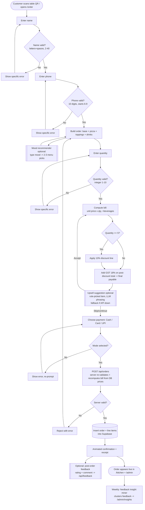

# Stage 1 — Discovery & Scope

**Project:** SliceMatic (PizzaFlow, Batch C2) · **Client:** Rajan Sharma, single-outlet pizza brand, New Ashok Nagar, Delhi

---

## Part A — Problem Discovery

**Current process walkthrough.** A customer walks in, is seated, and is handed a tablet running a Google Form. They pick a base, pizza, and toppings from dropdowns with no cross-validation. The submission lands in a Google Sheet as raw, unstructured data. Staff then manually price the order, decide (often from memory) whether a discount applies, calculate GST by hand or estimate it, and confirm payment mode verbally — none of which is recorded anywhere queryable.

**Where it fails — specific pain points:**

1. **Manual bill calculation.** Staff compute every bill by hand or on a phone calculator. Slow, inconsistent between staff, and error-prone — a wrong bill either overcharges (damaging trust) or undercharges (silent revenue loss with no way to detect it).
2. **No systematic discount logic.** No enforced rule for when/how much discount applies. Identical orders get billed differently depending on who is at the counter and how busy it is.
3. **GST calculation errors.** GST applied manually and inconsistently — sometimes on the pre-discount amount, sometimes forgotten. Creates compliance risk and inconsistent pricing.
4. **No name/phone validation.** The form accepts any text. Garbage names and malformed numbers make the captured data useless for contacting customers, recognizing repeats, or resolving disputes.
5. **No combination validation.** The form cannot block a nonsensical order, so bad orders reach the kitchen with no error caught before food is made.
6. **Peak-hour bottleneck / off-peak idle.** Every order needs a staff member to walk the customer through the form and then compute the bill. Throughput is capped to staff availability regardless of demand — queues at peak, idle staff when quiet. The bottleneck is structural (one order at a time, staff-mediated), not seasonal.
7. **No payment log.** Payment mode is confirmed only verbally. No reliable record of cash vs card vs UPI, so reconciliation and accounting run on memory.
8. **No replacement/refund tracking.** No system of record for corrections/refunds — Rajan cannot audit how often they happen or what they cost.
9. **No inventory/resource visibility.** With no structured order history, ingredient demand cannot be forecast → stockouts or overstock.
10. **Cannot identify best-sellers by day/time.** The Sheet accumulates rows but is never queried — Rajan cannot answer "which pizza sells best on weekends".
11. **Cannot identify peak walk-in hours.** No timestamp analysis → no staffing insight to relieve the Problem 6 bottleneck.
12. **Cannot evaluate discount profitability.** Discounts aren't logged or enforced consistently, so Rajan cannot tell whether discounting grows sales or just erodes margin.

**Cost of these failures.** Billing/GST errors (1–3) leak revenue and create compliance risk on *every* order. Missing validation (4–5) degrades the data everything downstream depends on. The structural bottleneck (6) caps growth and wastes labour cost in slow hours. Absent financial/analytical visibility (7–12) means staffing, discounting, inventory, and menu decisions are all guesswork rather than evidence.

---

## Part B — AI Opportunity Mapping

Three genuinely LLM-dependent opportunities were identified. All three were built for Stage 3 (two core + one bonus).

### Opportunity 1 — Customer Review & Feedback Insight Miner
- **Problem:** Google reviews and post-order feedback exist, but nobody reads or synthesizes them; recurring complaints ("cold on arrival", "too oily", "order was wrong") go unnoticed until they've cost repeat customers.
- **What it does:** An LLM reads a batch of review/feedback text, extracts recurring themes, categorizes complaints (delivery time, taste, order accuracy, staff behaviour, value), and surfaces the 2–3 most actionable issues with a suggested fix — not just a star average.
- **Data:** Existing Google reviews + an optional post-order feedback field (added cheaply to the ordering flow).
- **Success:** Rajan sees, in plain language, what's actually driving dissatisfaction and can act on a specific recurring issue.
- **Why AI:** Clustering/summarizing free-form complaints into actionable categories is genuine unstructured-text reasoning — a keyword count can't do it reliably.

### Opportunity 2 — Smart Upselling Assistant *(primary)*
- **Problem:** No structured way to increase order value; add-on suggestions depend on staff memory.
- **What it does:** Given the current order, suggests a complementary item (topping/side/upgrade) with a brief natural-language reason. Hybrid: a rule/heuristic pairing table (a new outlet lacks order volume for basket mining) + an LLM to phrase the suggestion contextually.
- **Data:** Menu (available today) + hand-authored pairing logic; data-driven mining becomes viable later.
- **Success:** Higher average order value; suggestions that feel relevant, not random.

### Opportunity 3 — Mood-Based Menu Recommender *(second)*
- **Problem:** Indecisive/first-time customers don't know what to order; staff can only recite options, slowing ordering and ending in generic choices.
- **What it does:** Customer types a mood/craving ("rough day", "celebrating", "something new"); an LLM constrained by a mood→attribute system prompt returns 2–3 concrete picks from the *actual loaded menu*, each with a one-line reason. Single input, single structured output — not a chatbot.
- **Data:** Only menu data — deployable immediately.
- **Success:** Faster, more confident ordering; higher topping/combo attach rate; a memorable experience.
- **Guardrails:** Output restricted to valid menu items; empty/nonsensical/off-topic input falls back to a default popular combo.

**Considered and explicitly excluded (honest "not everything needs AI"):**
- **Demand prediction ("Tomorrow Prep") & Discount/Leakage Optimizer** — need historical order data that a brand-new system doesn't have yet. Future work.
- **Returning-customer "vibe" profiler** — underspecified (no concrete signal/measure). Excluded until definable.
- **Voice ordering** — high risk for a live 10-minute demo (STT reliability, mic failure, latency). Stretch goal only.
- **End-of-Day Operations Summarizer** — deterministic aggregation over logged orders; a rule-based script solves it more cheaply than an LLM. Deliberately kept non-AI.

---

## Part C — Solution Scope

**What we're building (plain English).** A full-stack ordering and billing system that replaces the Google Form entirely: it validates customer details and combinations at entry, applies discount and GST rules consistently on every order, logs every order (items, pricing, discount, payment mode) in a queryable Postgres database, and gives Rajan an admin view plus analytics. On top of this we add a **Smart Upselling Assistant** and a **Mood-Based Menu Recommender** (both LLM-driven, tightly scoped), and a **Customer Review & Feedback Insight Miner** as the third/bonus AI feature.

**Explicitly out of scope:**
- Kitchen Display System / automated ticket printing — orders are logged digitally, but routing to chefs stays manual.
- Inventory/stock tracking — acknowledged (Problem 9) but needs consumption history we don't have.
- Demand forecasting & discount-policy optimization — need historical data that doesn't exist yet.
- Native mobile app — the system is a responsive web app.
- Multi-outlet support — single New Ashok Nagar outlet only.
- Voice ordering — stretch goal, not a committed deliverable.

**Assumptions:**
- A device with stable internet is available during business hours.
- The menu keeps the "1 Base + 1 Pizza + N Toppings (+ Beverages)" structure; Rajan updates pricing/items by editing the menu files/DB.
- Customers will share name + phone at checkout; staff won't bypass validation for "regulars".
- Discount policy (10% at qty ≥ 5) and GST (18%) stay fixed for the project.
- OpenRouter access/keys remain available and within budget through July 7.

**What could go wrong (honest risks):**
1. **Adoption resistance** — a more structured, validation-heavy flow can feel slower to staff used to the Google Form, especially under peak-hour pressure.
2. **AI latency at peak** — Upsell + Mood call OpenRouter live; a 2–3s delay is fine for one customer but can compound during a rush. Mitigation: deterministic fallbacks and non-blocking calls.
3. **Suggestion quality** — with no historical data, hand-authored pairing may occasionally feel generic, undermining trust in the demo.
4. **Network dependency on Supabase** — a full store internet outage halts ordering entirely (worse than an offline paper process), even though it fixes everything else.
5. **Guardrail failure on Mood recommender** — dark/offensive/off-topic input must fall back gracefully; weak guardrails could produce embarrassing output live.

---

## Part D — User Flow Diagram

Complete ordering journey, including every decision point and error branch. Readable top-to-bottom.

**Plain-text fallback (if the diagram doesn't render):**

1. Customer opens `/order?table=N` → **Name** (reject unless letters/spaces, 2–40) → **Phone** (reject unless 10 digits starting 6–9).
2. **Build order** (base, pizza, toppings, drinks). *Optional:* Mood recommender suggests picks from the live menu.
3. **Quantity** (reject unless integer 1–10). Bill computed; **if qty ≥ 5 → 10% discount line**; **GST 18% on post-discount total → final payable**.
4. *Optional:* Upsell suggestion before payment (accept → re-price; skip → continue; falls back to a template if the API is down).
5. **Payment** (Cash/Card/UPI; reject empty). → `POST /api/orders` **re-validates and recomputes the bill server-side** from DB prices (client prices never trusted).
6. On success → order + line items saved to Supabase → animated receipt → appears live in `/kitchen` and `/admin`. *Optional:* customer leaves rating + comment.
7. Weekly, the **Feedback Insight Miner** clusters feedback into actionable issues on `/admin/insights`.
